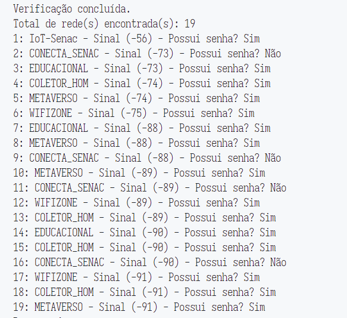

# Projeto 1 - Wifi-Scanner 

## Ánalise de redes Wifi 

Neste primeiro projeto temos o objetivo de análisar e procurar redes WiFi com melhor conexão, quantas redes foram encontradas e quais redes possuem senha.

### 1 - Quantas redes WiFi foram encontradas? 
R= No primeiro teste foram encontradas 11 redes, no segundo teste o programa encontrou 22 redes e por fim, encontrou 25 redes. 

### 2 - Qual a rede com sinal mais forte? 
R= A rede WiFi com conexão mais forte foi IoT-Senac com sinal (-53)

### 3 - Quais redes possuem senha? 
R= 
